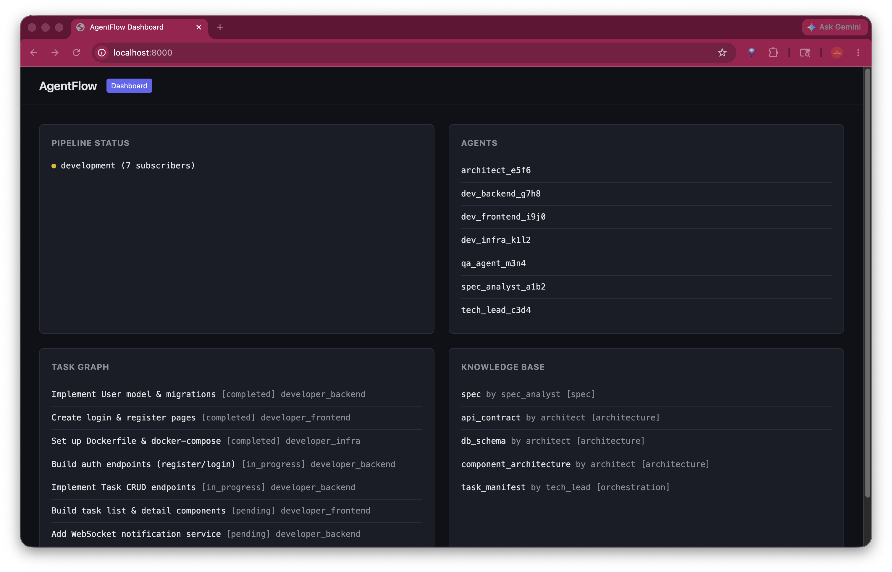
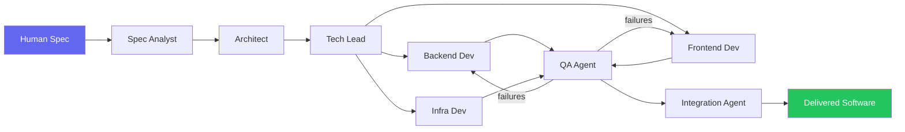
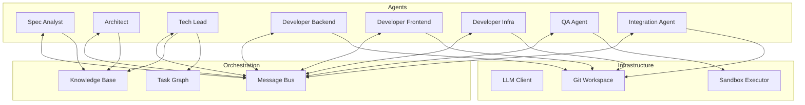
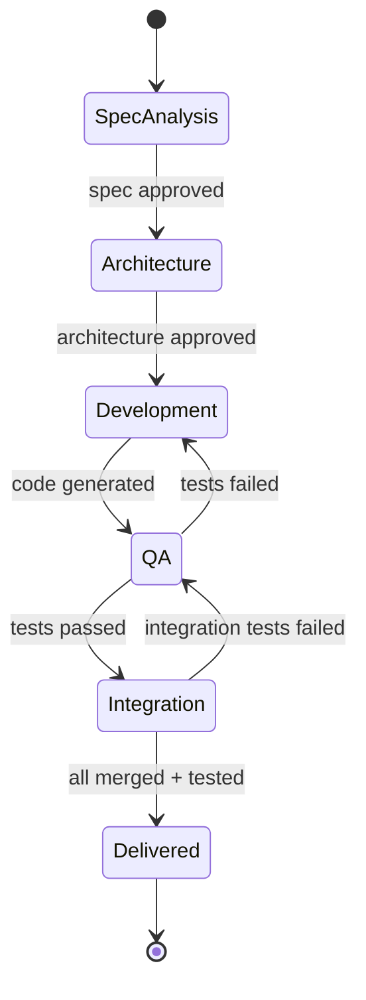

# AgentFlow — AI Software Development Factory

> **Give it a spec. Get back production-ready software.**

AgentFlow is an autonomous software development factory powered by a swarm of specialized AI agents. Unlike one-shot code generators, AgentFlow mirrors a real engineering org — it interviews you to refine requirements, architects the system, develops in parallel tracks, tests rigorously, and delivers deployable software. No GitHub dependency. No manual git workflows. Just spec in, software out.



## Quick Start

### Prerequisites

- Python 3.11+
- An [Anthropic API key](https://console.anthropic.com/)

### Install

```bash
git clone https://github.com/Vraj1234/AgentFlow.git
cd AgentFlow
python3 -m venv .venv && source .venv/bin/activate
pip install -e ".[dev]"
```

### Run the Pipeline

```bash
export ANTHROPIC_API_KEY="your-key-here"
agentflow new "Build a task management API with user auth and real-time notifications"
```

### Launch the Dashboard

```bash
agentflow dashboard
# Open http://localhost:8000 in your browser
```

The dashboard shows real-time pipeline status, registered agents, the task graph, and knowledge base entries. It auto-refreshes every 3 seconds.

### Run Tests

```bash
pytest tests/ -v                          # all 144 tests
pytest --cov=src --cov-report=term-missing # with coverage
```

### Lint & Format

```bash
ruff check src/ tests/
ruff format src/ tests/
```

### Docker

```bash
export ANTHROPIC_API_KEY="your-key-here"
docker compose up
```

## The Problem

AI code generation today is either:
- **One-shot** — paste a prompt, get a blob of code, pray it works
- **Human-bottlenecked** — AI writes code, but humans still manage branches, resolve conflicts, run tests, coordinate tasks

Neither approach scales. Real software development requires *iteration*, *coordination*, and *quality gates* — things that current tools punt back to humans.

## How It Works



The human stays in the loop at decision points, not in the weeds of implementation.

## Agent Architecture



### 1. Spec Analyst Agent
- Receives the initial human spec (plain English, bullet points — whatever)
- Calls the LLM to identify ambiguities and generate clarifying questions
- Produces a **StructuredSpec** (Pydantic-validated) with features, constraints, acceptance criteria, and tech stack
- Stores the spec in the knowledge base for downstream agents

### 2. Architect Agent
- Reads the spec from the knowledge base
- Generates four structured artifacts via LLM:
  - **Database schema** — tables, columns, relationships (with Literal-constrained types)
  - **API contract** — endpoints with HTTP methods, request/response schemas
  - **Component architecture** — modules with responsibilities and dependencies
  - **Infrastructure blueprint** — services, container images, networking
- All artifacts validated through Pydantic models with non-empty field constraints

### 3. Tech Lead Agent
- Decomposes the spec and architecture into parallelizable **tasks**
- Populates the **TaskGraph** with dependency edges
- Dispatches ready tasks to developer agents via the message bus
- Handles task completion/failure messages and cascades status updates

### 4. Developer Agents (3 specialties)
A single `DeveloperAgent` class parameterized by specialty:
- **Backend** — reads `api_contract` and `db_schema`, generates API/model code
- **Frontend** — reads `component_architecture`, generates UI components
- **Infrastructure** — reads `infra_blueprint`, generates Dockerfiles and CI config

Each developer:
- Works on an isolated git branch (`agent/developer_backend`, etc.)
- Writes LLM-generated files with path traversal protection
- Creates a git checkpoint after each generation
- Restores the workspace branch in a `finally` block

### 5. QA Agent
- Generates test files from the spec's acceptance criteria via LLM
- Writes tests to the workspace and runs them via `PytestRunner`
- Supports a retry loop (configurable `max_retries`)
- Reports pass/fail results back through the message bus

### 6. Integration Agent
- Uses `WorkspaceMerger` to combine all agent branches
- Detects conflicts via `git merge --no-commit` probing
- Runs the full test suite on the merged codebase
- Writes integration results to the knowledge base

## Pipeline Stages



## Human-in-the-Loop Gates

| Gate | What happens | Human action |
|------|-------------|--------------|
| **Spec Approval** | Interview complete, formal spec ready | Review, edit, approve |
| **Architecture Review** | System design complete | Approve or request changes |
| **Mid-Development Check** | Core features implemented, tests passing | Review progress, adjust priorities |
| **Final Delivery** | Integrated codebase, all tests green | Accept or request revisions |

Between gates, agents work autonomously. Feedback at any gate propagates back through the agent chain.

## Tech Stack

| Component | Technology |
|-----------|-----------|
| **Agent Framework** | Python 3.11+ with async/await, Anthropic Claude API |
| **LLM Integration** | `LLMClientProtocol` with retry/backoff, `MockLLMClient` for testing |
| **Orchestration** | Custom TaskGraph with topological wave scheduling |
| **Communication** | Async message bus (in-process pub/sub with history) |
| **Shared State** | Append-only versioned KnowledgeBase with tag-based search |
| **Version Control** | GitPython with branch-per-agent isolation and semantic diff |
| **Code Execution** | Async subprocess sandbox with timeout + PytestRunner |
| **CLI** | Typer with Rich terminal output |
| **Web Dashboard** | FastAPI + WebSocket with security headers |
| **Containerization** | Docker Compose with socket mounting for agent sandboxes |

## Project Structure

```
AgentFlow/
├── src/
│   ├── agents/
│   │   ├── base.py              # Agent ABC, AgentRole, AgentMessage
│   │   ├── spec_analyst.py      # Interview & spec refinement
│   │   ├── architect.py         # Architecture artifact generation
│   │   ├── tech_lead.py         # Task decomposition & orchestration
│   │   ├── developer.py         # Code generation (backend/frontend/infra)
│   │   ├── qa.py                # Test generation & validation
│   │   └── integrator.py        # Workspace merging & packaging
│   ├── orchestrator/
│   │   ├── task_graph.py        # Dependency-aware task scheduler
│   │   ├── message_bus.py       # Inter-agent async pub/sub
│   │   └── knowledge_base.py    # Versioned shared context store
│   ├── llm/
│   │   ├── client.py            # Anthropic SDK wrapper + LLMClientProtocol
│   │   └── mock.py              # Deterministic mock for testing
│   ├── vcs/
│   │   ├── workspace.py         # Git workspace operations
│   │   ├── branch_manager.py    # Branch-per-agent lifecycle
│   │   ├── semantic_diff.py     # Structural diff parsing
│   │   └── merger.py            # Branch merging with conflict detection
│   ├── sandbox/
│   │   ├── executor.py          # Async subprocess execution
│   │   └── test_runner.py       # Pytest wrapper with result parsing
│   └── interface/
│       ├── cli.py               # Typer CLI (new, status, dashboard)
│       ├── pipeline.py          # Pipeline stage orchestration
│       └── dashboard/           # FastAPI web dashboard
│           ├── app.py           # REST + WebSocket endpoints
│           └── static/
│               └── index.html   # Dark-themed dashboard UI
├── tests/                       # 144 tests across 13 test files
├── pyproject.toml
├── Dockerfile
├── docker-compose.yml
└── README.md
```

## CLI Reference

```bash
# Start a new pipeline from a spec
agentflow new "your specification text"

# Check pipeline status
agentflow status

# Launch the web dashboard
agentflow dashboard                        # http://localhost:8000
agentflow dashboard --port 3000            # custom port
agentflow dashboard --host 0.0.0.0         # expose on all interfaces

# Version
agentflow --version
```

## What Makes This Different

| Feature | Typical AI Code Gen | CrewAI-style Teams | AgentFlow |
|---------|--------------------|--------------------|-----------|
| Spec refinement | None — GIGO | Basic prompt to output | Interactive interview with tradeoff analysis |
| Development model | One-shot generation | Linear pipeline | Parallel agents with shared context |
| Conflict resolution | Manual (git merge) | Not addressed | Git-based isolation with structured integration |
| Quality assurance | "Hope it works" | Tests generated but often not run | Closed-loop: test, fail, fix, retest |
| Human oversight | Review everything | Review final output | Gate-based: approve milestones, not lines |
| Iteration | Start over | Start over | Feedback propagates, agents revise |

## License

MIT
